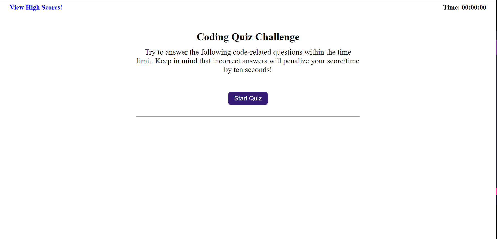
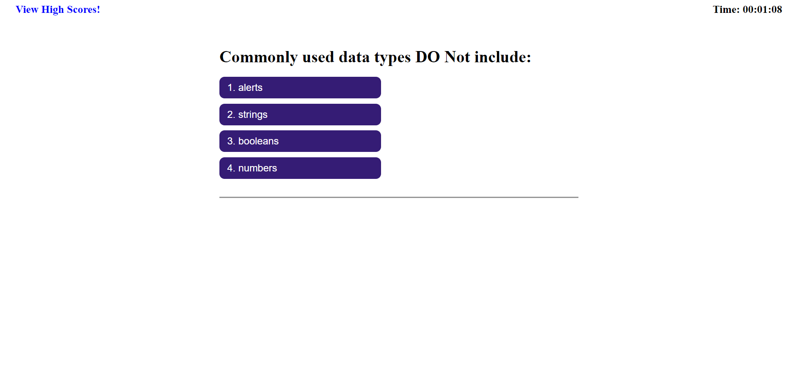
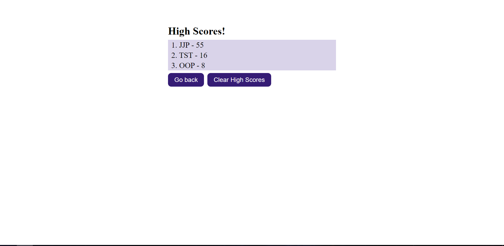
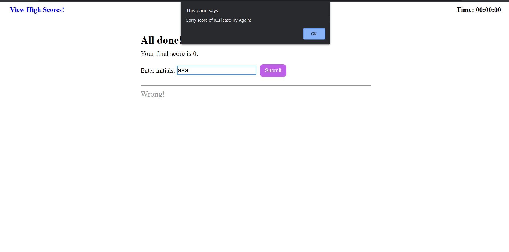

# Javascript__Fundamentals_Quiz

## Javascript__Fundamentals_Quiz Requirements
 Code javascript DOM elements and behaviour to do the following:

 ### Game Quiz Criteria:
        - [✔️] Show home page with start start quiz button
        - [✔️] Start quiz when button is clicked
        - [✔️] Start timer when button clicked
        - [✔️] Programmaticaly generated DOM elements to have the questions.
        - [✔️] Programmaticaly generated DOM elements to have possible answers.
        - [✔️] Tell if answer is right or wrong.
        - [✔️] Deduct 10seconds is answer is wrong.
        - [✔️] End test if time's up or if all questions are answered.
        - [✔️] Prompt users for initials (Text box limited to 3 characters).
        - [✔️] Once the submit button is clicked score and intials are saved.
        - [✔️] Saved data is displayed in highscores page seen in the home page.

   ### Checks
        - Upon scoring 0 no score will be saved.

Please see link below for Coding Quiz accessible URL: 
        https://darkjuanjo.github.io/Javascript__Fundamentals_Quiz/
        
**Below is the source code for the Coding Quiz in GitHub. Please note that code is in assets/js. **
        https://github.com/darkjuanjo/Javascript__Fundamentals_Quiz

## See below for some screenshots

### Home Page

### Quiz and Timer Started

### High Scores!

### Score of Zero

